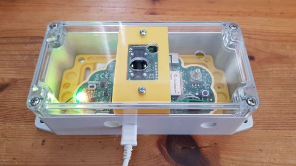
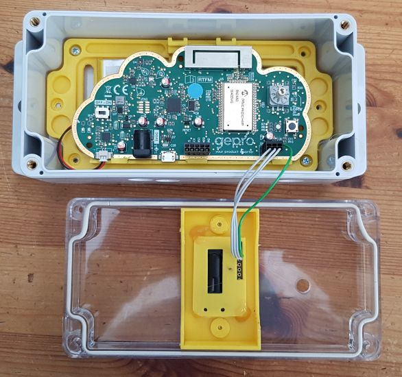

# HAN IoT KISS LoRa sketch using SCD30

This sketch is using the SCD30 CO2 sensor in combination with the KISS LoRa. 

## Additions to the box
To allow the SCD30 to work properky, the SCD30 is installed in the (transparent) cover of the box. To allow easy installation a small support was designed to carry the SCD30. This support was designed using Sketchup and is in both .skp and .stl format available in this repository. See "[bracket ](../bracket/)".

*KISS LoRa with SCD30*

*Internal view on KISS LoRa with SCD30*

# Disclaimer
The content of this repository is provided in the hope that it will be useful, but WITHOUT ANY WARRANTY; without even the implied warranty of MERCHANTABILITY or FITNESS FOR A PARTICULAR PURPOSE.
  
# License
All copyrights belong to their respective owners and are mentioned there were known.

This repository is part of the IoT classes delivered at HAN Engineering ELT.

This repository is free: You may redistribute it and/or modify it under the terms of a Creative  Commons Attribution-NonCommercial 4.0 International License  (http://creativecommons.org/licenses/by-nc/4.0/) by Remko Welling (https://ese.han.nl/~rwelling/) E-mail: remko.welling@han.nl 

 This work is licensed under a <a rel="license" href="http://creativecommons.org/licenses/by-nc/4.0/">Creative Commons Attribution-NonCommercial 4.0 International License</a>.
