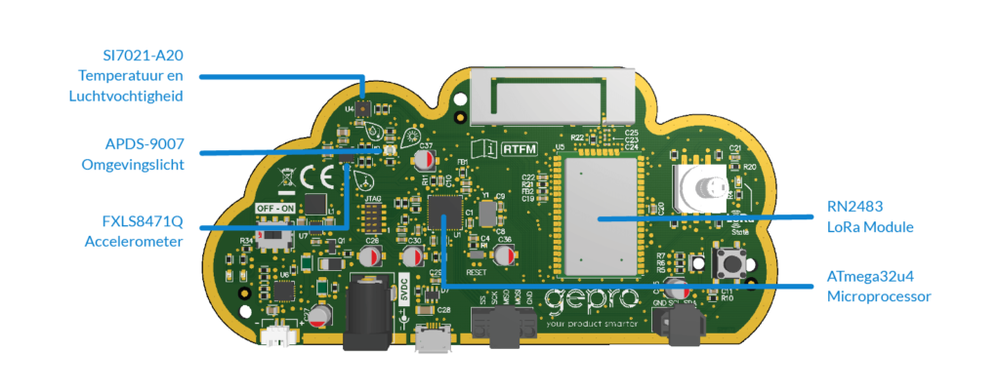
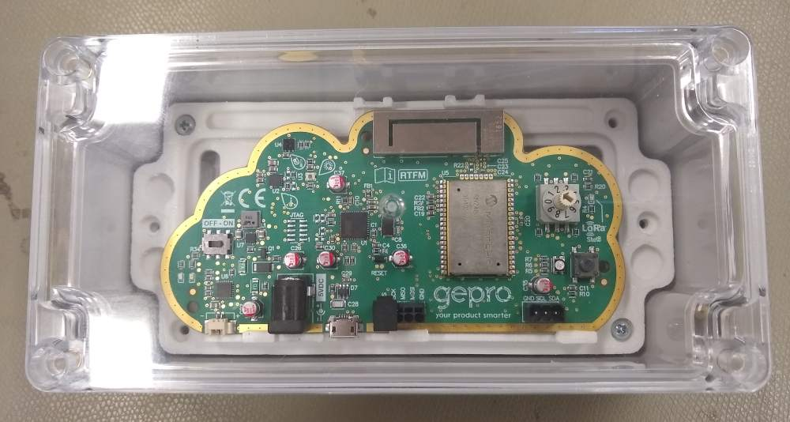

# HAN IoT KISS LoRa

This repository presents the KISS LoRa in a housing to is useable together with Aruino sketches in combination with various sensors. The KISS LoRa housing and sketches are being used by at the University of Applied Sciences HAN in Arnhem at the Faculty Engineering and Automotive, Embedded Systems Engineering.

# About KISS LoRa
The KISS LoRa was a gadget that was issued to visitors to the Dutch electonics fair <a rel="EandA" href="https://fhi.nl/eabeurs/kiss-lora-ea-2017-gadget/">Electroncs & Applications</a> and produced in a serie of aproximately 2000 devices. The purpose was to attract visitors to <a rel="TTN" href="https://www.thethingsnetwork.org/">The Things Network</a> and to propmote companies that participated in producing the KISS LoRa.

Image source: https://diystuff.nl/lorawan/kisslora/

The board contains: 

 - Microchip RN2483 Low-Power Long Range LoRa™ Technology Transceiver Module.
 - ATmega32u4 8-bit Microcontroller with 32K bytes of ISP Flash and USB Controller.
 - FXLS8471Q 3-Axis Linear Accelerometer.
 - APDS-9007 Ambient Light Photo Sensor with Logarithmic Current Output.
 - SI7021-A20 I2C Humidity and Temperature sensor.

## Problems with KISS LoRa
Unfortionately the KISS LoRa was assembled with some wrong components. This resulted in a very poor radio perfomance because the antenna matching unit had the wrong components. These components can be replaced to make the KISS LoRa work aging properly. Modifications can be found at <a rel="forum" href="https://www.thethingsnetwork.org/forum/t/how-to-connect-utrecht-e-a-exhibition-kiss-lora-to-ttn/7619/102">The Things Network forum</a>.

## KISS LoRa documentation
Documentation on the KISS LoRa can be found at: https://github.com/YourproductSmarter/KISSLoRa-demo

# Making KISS LoRa usable
KISS LoRa is a very fancy board for promotioal purposes but not for a real live implementation. That is what you want because the board contains rudimentary environment sensors and can be easily expanded using the on board connectors. 

## Boxing KISS LoRa
To make it possible to box KISS LoRa a bracket was designed. The bracket was tailored for use with the MULTICOMP PRO Plastic Enclosure. This enclosure is Wall Mount, Polycarbonate, 55 mm, 160 mm, 80 mm, IP65 and availabale at <a rel="Farnell" href="https://nl.farnell.com/multicomp/mc001068/enclosure-ip65-pc-grey/dp/2544907">Farnell</a>, perfectly for the job. 

The bracket is available in .stl format for 3D-printing and the original Sketchup file. See folder "bracket" for these files.

To make the connectors and switches accessessible as well as to create access to the sensors for the environment holes shall be drilled in the enclosure.

## Connecting external hardware to KISS LoRa
Connecting external hardware to KISS LoRa should be easy because of the connectors available. Unfortionately the connectors do not provide VCC to power external sensors :disappointed:. But there is a workaround:

Close to the I2C connector R10 is located. This resistor connected to VCC and VCC here has a test point close to the I2C connectector. This testpoint can be (ab)used to power externa sensors.

*R10 in the LoRaKISS schema*

*R10 and the testpoint on the KISS LoRa PCB.*

## Example Arduino code
This repository contains multiple code examples to use the KISS LoRa. These are:

 1. LoRa_TX_RX_Cayenne_HAN, all features of the KISS LoRa board used in a single sketch
 2. LoRa_TX_RX_Cayenne_HAN_SCD30, reduced functionality of KISS LoRa board to allow use of the SCD30 environmental sensor.
 3. LoRa_TX_RX_Cayenne_HAN_BME680, reduced functionality of KISS LoRa board to allow use of the BME680 environmental sensor.

### LoRa_TX_RX_Cayenne_HAN
Features of this sketch are:

 + use of low power mode. Although KISS LoRa is not designed for low power, this sketch explands the life time of battery.
 + payload is CayenneLPP compatible.
 + on-board peripherals used: temperature, humidity, luminosity, accelerometer, rotary switch, button, blue and RGB led.
 + battery voltage of RN2483 read and send
 + interval at start us set using rotary switch to 1, 5, 15, 60 minutes.
 + presence is send using button
 + downlink message sets interval using CayenneLPP.

### LoRa_TX_RX_Cayenne_HAN with SCD30
This sketch is using the SCD30 environmental sensor with CO2 sensor. Because of the limited size of memory of the ATMEGA32U some features are removed to preserve memory. This sketch uses "LoRa_TX_RX_Cayenne_HAN.ino" as basis with the following changes:

 - low power is removed.
 - removed SparkFun_Si7021_Breakout_Library, replaced onboard temperature and humidity sensor for SCD30
 - removed accelerometer
 - removed board voltage reading from RN2483
 + added CO2 sensor reading to payload.
 

### Feature enhancements
The sketches are under development. Features that will be added:

 1. Use RGB to indicate air quality by showing a corresponding color.

# Disclaimer
The content of this repository is provided in the hope that it will be useful, but WITHOUT ANY WARRANTY; without even the implied warranty of MERCHANTABILITY or FITNESS FOR A PARTICULAR PURPOSE.
  
# License
All copyrights belong to their respective owners and are mentioned there were known.

This repository is part of the IoT classes delivered at HAN Engineering ELT.

This repository is free: You may redistribute it and/or modify it under the terms of a Creative  Commons Attribution-NonCommercial 4.0 International License  (http://creativecommons.org/licenses/by-nc/4.0/) by Remko Welling (https://ese.han.nl/~rwelling/) E-mail: remko.welling@han.nl 

 This work is licensed under a <a rel="license" href="http://creativecommons.org/licenses/by-nc/4.0/">Creative Commons Attribution-NonCommercial 4.0 International License</a>.
